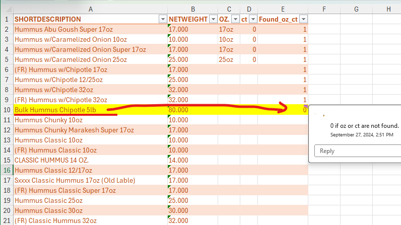
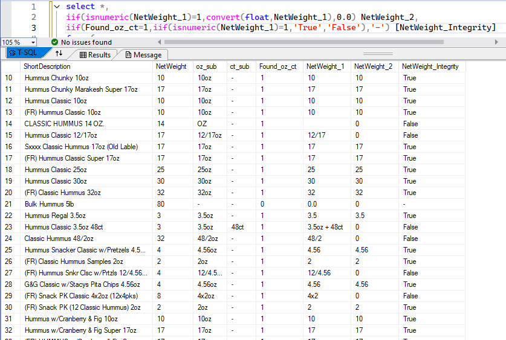
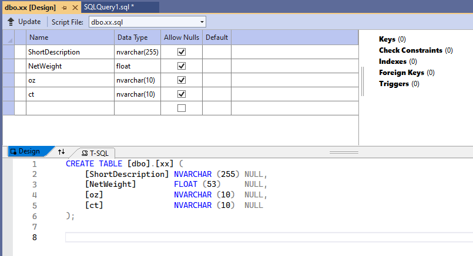

# Simple Query for Data Cleaning
create SQL queries to get the result as the sample data in [Excel](resources/Sample_Data.xlsx). that is,

1. consider the oz and ct word.
2. if oz or ct are not found, it shows 0 (zero), else 1 (one).
3. consider the NetWeight.
4. the database id SQLServer.

[SQL query](query1.sql)

